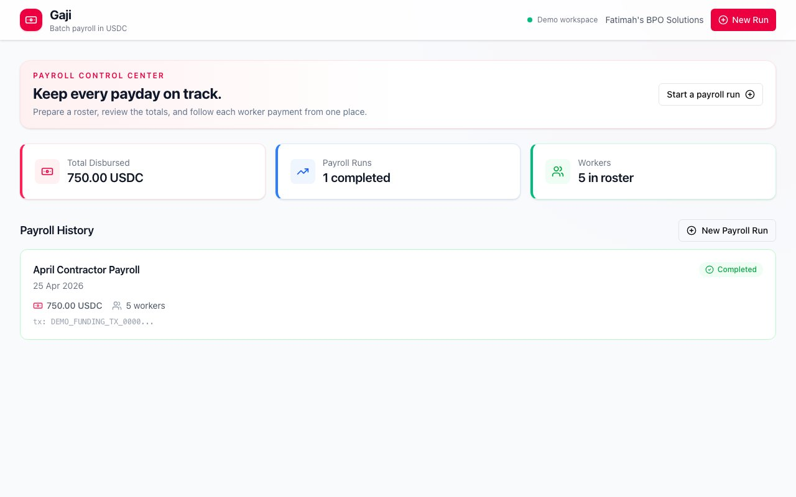
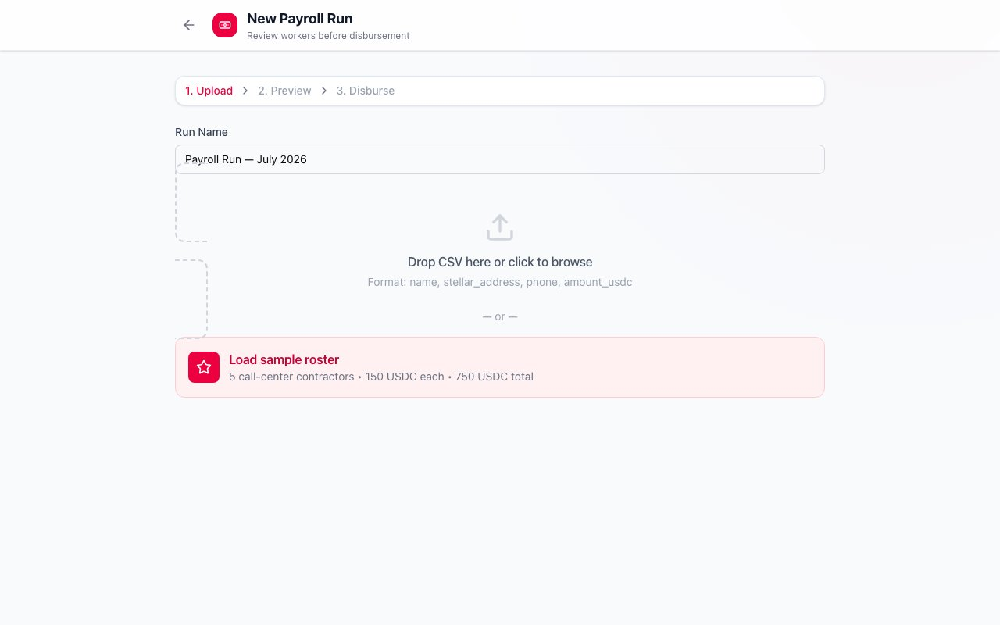
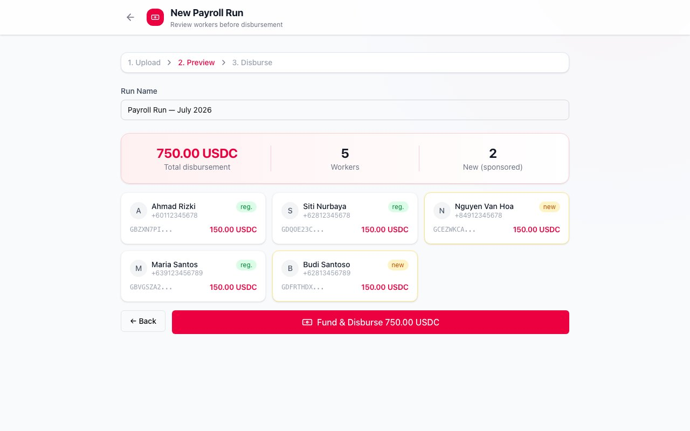
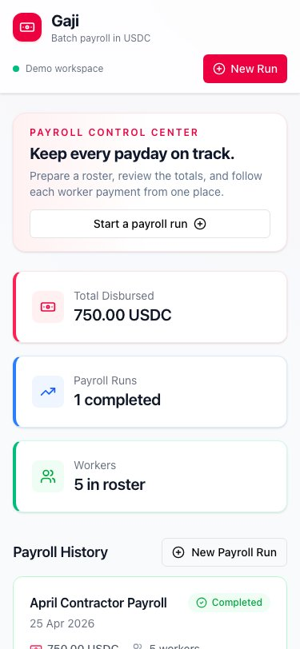

# SME Batch Payroll

Batch payroll preparation and reconciliation for small businesses paying workers in Stellar assets.

## Why it exists

Small businesses often manage contractor payroll from spreadsheets and chat threads. Gaji gives an employer one compact workspace to upload a roster, review the total, and follow each worker's payment status.

## Demo & live preview

- Public demo: [gaji-024.vercel.app](https://gaji-024.vercel.app)
- Demo account: Fatimah's BPO Solutions
- Demo roster: 5 workers receiving 150 USDC each
- Demo mode uses in-memory data so the preview works without a database or wallet

The public preview focuses on the product flow. The repository also contains a deployed Soroban contract and a complete Mainnet batch lifecycle.

## Mainnet deployment

- Network: Stellar Mainnet
- Contract: `CBD3NXEYRBUNF72EZ2NOSZH4W6CNKVMVK25A53NF5VQNKK6SLMYUC6DG`
- Latest functional transaction (`close`): [5b5a2404…409e](https://stellar.expert/explorer/public/tx/5b5a2404a7deed6115289ea3be001d1abc3ddb392d819769022c6373a229409e)
- Deployment manifest: [`contracts/batch-payroll/deployment.json`](contracts/batch-payroll/deployment.json)

## Stellar surface

- Classic Stellar USDC is represented with seven-decimal stroops (`1 USDC = 10,000,000`)

- Batch payment and claimable-balance intent preparation
- Exact Horizon reconciliation per worker and batch
- External signer boundary; no application-held private key
- Real batch path: `POST /api/payroll-runs/:id/prepare` returns unsigned XDR, and `POST /api/payroll-runs/:id/confirm` verifies the employer signature and exact operations before Horizon submission

## Readiness status

The batch-payroll contract is live on Mainnet. Verified transactions cover upload, deployment, initialization, batch creation, worker addition, funding, claim, and close.

See [`docs/`](docs/) for architecture, API, deployment evidence, operations, testing, and user guidance.

## How a demo run works

1. Open the dashboard and review payroll totals and previous runs.
2. Start a new run with a CSV roster or the sample roster.
3. Review worker names, addresses, and USDC amounts.
4. Fund the run in demo mode and watch the staged disbursement status update.

## Local demo

The public preview runs in demo mode with in-memory payroll data, so the dashboard and staged disbursement flow work without a database or wallet. For a local run, install dependencies and use `npm run dev`.

## Screens

### Dashboard

### New payroll roster

### Worker preview before disbursement

### Mobile dashboard

Screens are captured from the local production build that powers the public preview.

Keep all secrets outside Git.

## Safety boundary

Employers and workers authorize actions from their own wallets. The application must reconcile each transaction hash before marking a payroll stage complete.

Apply `drizzle/0001_unsigned_payroll_intents.sql` before using the batch intent routes.
